# Roteiro do mobile — o que copiar do sistema Kiko Pescados

> **Para o agente que vai executar:** este documento é **inspiração visual e
> técnica**. Ele não pede nenhuma mudança de lógica, de fluxo ou de
> funcionalidade. Nenhum botão muda de função, nenhuma aba muda de destino,
> nenhuma regra de negócio é tocada. O que muda é **como a mesma tela se
> comporta e aparece abaixo de 1024px de largura**.
>
> O desktop **já está bom** e não é para mexer nele. Todo CSS novo daqui vive na
> base (mobile-first) ou dentro de uma media query estreita; o desktop continua
> onde está.

---

## 1. O diagnóstico: o que está errado hoje, e por quê

Antes da inspiração, o retrato. Estas são as capturas atuais, e cada problema
abaixo está visível nelas.

| | | | |
|---|---|---|---|
| 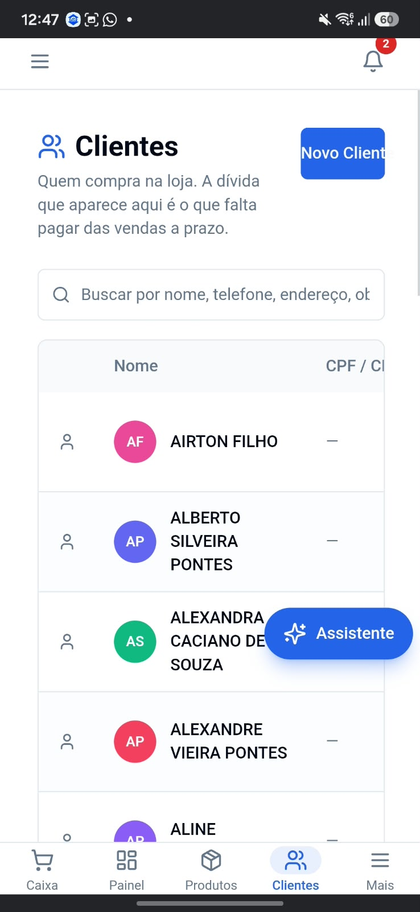 | 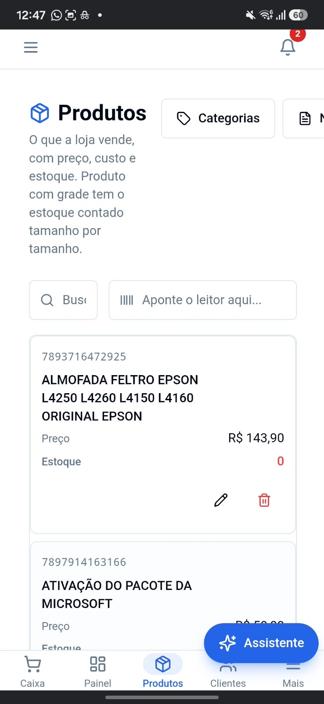 | 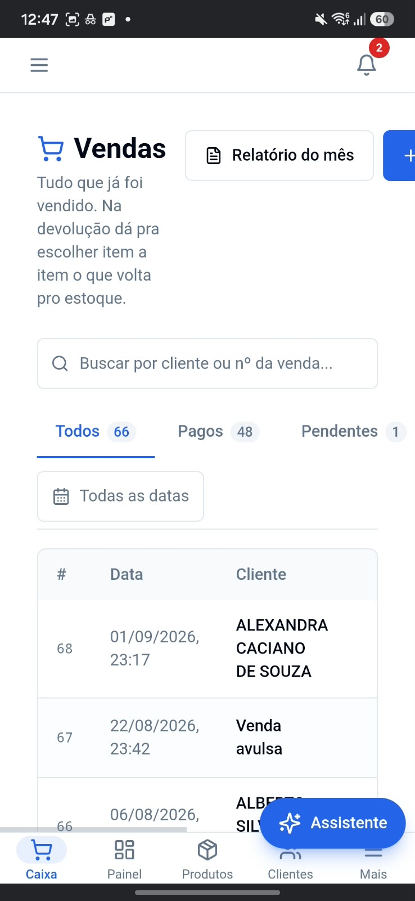 | 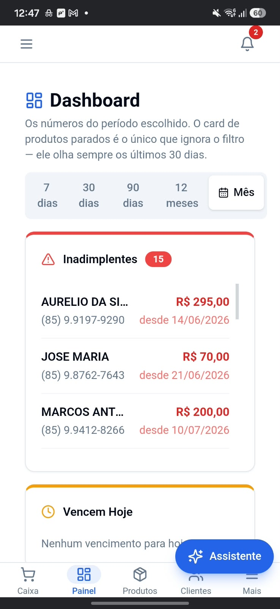 |
| Clientes | Produtos | Vendas | Painel |

**O erro de raiz é um só, e todos os outros descendem dele: a tela de desktop
foi ENCOLHIDA em vez de REDESENHADA.** Um layout de desktop espremido em 360px
não vira um layout de celular — vira um layout de desktop quebrado. As larguras
continuam de desktop, as densidades continuam de desktop, as tabelas continuam
tabelas, e o que não cabe simplesmente sai pela direita.

Os treze sintomas, em ordem de gravidade:

1. **A página rola na horizontal.** Em *Clientes* o botão "Novo Client**e**"
   está cortado ao meio e a coluna "CPF / C**NPJ**" sai da tela. Em *Produtos*,
   "Categorias" e o botão seguinte saem. Em *Vendas* há uma barra de rolagem
   horizontal visível no rodapé, e o botão azul "+" está pela metade.
   ⚠️ **Nada numa tela de celular pode rolar de lado, exceto um contêiner que
   foi feito de propósito para isso.** Rolagem horizontal na página inteira é o
   sintoma número um de layout não adaptado — e o usuário nunca descobre o que
   ficou escondido, porque nada indica que existe conteúdo à direita.

2. **Tabela de desktop no celular.** *Clientes* e *Vendas* mostram `<table>` com
   cabeçalho `Nome | CPF/CNPJ | …` e `# | Data | Cliente | …`. A correção **não
   é fazer a tabela rolar** — é que no celular uma linha de tabela deixa de ser
   linha e vira **um item de lista** (ver §6).

3. **A barra inferior está colada na borda, quadrada e de ponta a ponta.** Ela
   encosta na barra de gestos do Android, não respeita área segura, não tem
   cantos, não tem sombra, e a "pílula" do item ativo é um retanguinho só atrás
   do ícone — o rótulo fica de fora dela. Não há animação nenhuma: a marca
   apaga numa aba e acende na outra.

4. **A barra inferior não é fixa.** Pelo relato: "eu tinha que descer toda a
   tela pra ela aparecer". Ela está no fluxo do documento, no fim da página.
   Barra de navegação que exige rolar até o fim para ser usada não é navegação.

5. **O botão "Assistente" flutua no meio do conteúdo.** Nas quatro capturas ele
   cobre nome de cliente, preço de produto e linha de venda. Ele não tem
   relação com a barra inferior, não tem faixa reservada, e não some nem encolhe
   ao rolar.

6. **O cabeçalho gasta uma tela inteira antes do primeiro dado.** Uma faixa só
   com hambúrguer + sino; abaixo, um título gigante ("Clientes", ~34px); abaixo,
   um parágrafo explicativo que no desktop é uma linha e no celular ocupa
   **quatro**. Em *Vendas* são seis linhas. Some tudo: ~40% da primeira tela
   gasta antes de aparecer um cliente.

7. **Hambúrguer E barra inferior ao mesmo tempo.** Duas navegações concorrentes
   ensinam duas rotas para a mesma coisa e nenhuma das duas bem.

8. **Densidade péssima.** Uma linha de cliente tem ~150px de altura: avatar
   circular grande, **mais** um ícone de pessoa cinza redundante à esquerda,
   mais o nome em CAIXA ALTA quebrando em três linhas. Cabem cinco clientes na
   tela de um celular.

9. **Avatares em cores aleatórias saturadas** (rosa, roxo, verde, vermelho).
   Elas não codificam nada — são ruído — e competem com as cores que **têm**
   significado (o vermelho de dívida, no Painel).

10. **Cores de estado sem sistema.** Vermelho puro, amarelo puro, azul puro,
    com faixa colorida grossa no topo dos cards. Sem tokens, sem tema escuro,
    sem distinção entre "vermelho de preencher" e "vermelho de ler".

11. **O seletor de período quebra dentro de si mesmo.** "7 / dias", "30 / dias",
    "90 / dias", "12 / meses" em duas linhas cada, e o botão "Mês" escapa da
    caixa cinza que deveria contê-lo.

12. **Alvos de toque pequenos demais.** Os ícones de lápis e lixeira em
    *Produtos* têm ~24px sem área de folga. O mínimo é 44×44.

13. **Texto de ajuda idêntico ao do desktop.** A mesma string longa, no mesmo
    tamanho, na mesma cor. No celular ela precisa ser mais curta, menor e mais
    apagada — ou não estar ali.

---

## 2. A referência: o sistema Kiko Pescados

Estas são capturas reais do sistema Kiko num Samsung, mesma classe de aparelho
das capturas acima.

> ⚠️ **Sobre os tamanhos das imagens:** as marcadas *"página inteira"* são
> capturas **estendidas** do Samsung — o próprio celular rola a página e costura
> os pedaços num print só. Elas **não** mostram o que cabe numa tela; servem
> para ver a página do começo ao fim. As marcadas *"topo"* são capturas normais
> e **essas sim** mostram exatamente o que o olho vê de uma vez.

### 2.1 As quatro abas, em capturas normais

Repare na barra inferior nas quatro: é a **mesma** pílula, em quatro posições
diferentes. É esse o efeito a reproduzir.

| 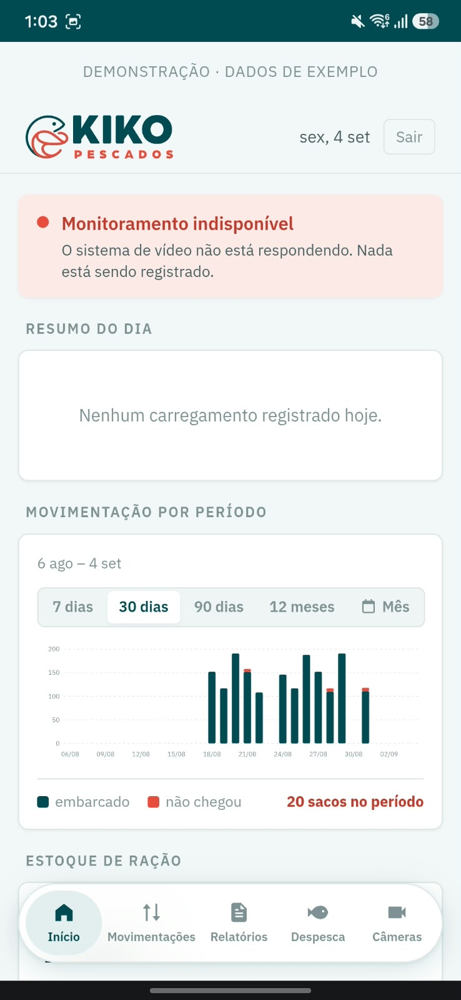 | 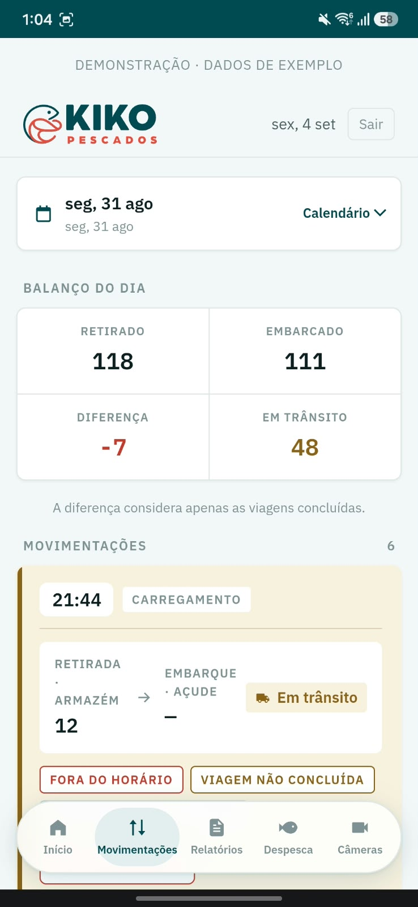 |
|---|---|
| **Início** — pílula na 1ª casa | **Movimentações** — pílula na 2ª casa |

| 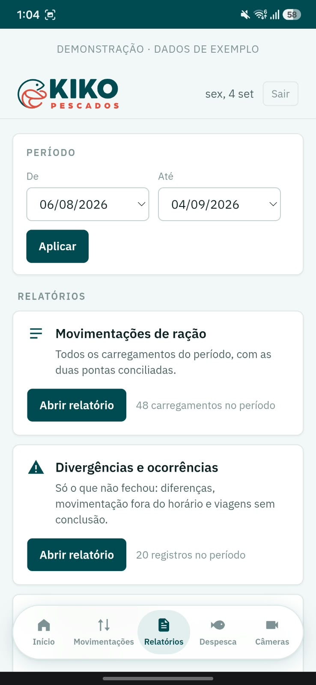 | 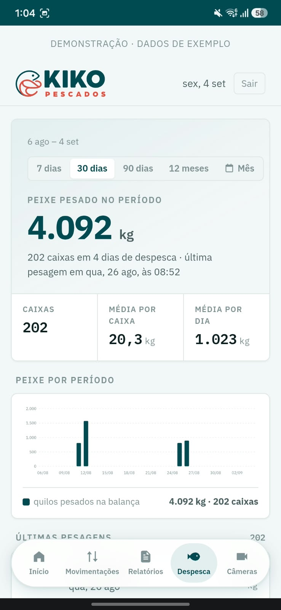 |
|---|---|
| **Relatórios** — pílula na 3ª casa | **Despesca** — pílula na 4ª casa |

### 2.2 As páginas inteiras (capturas estendidas)

| 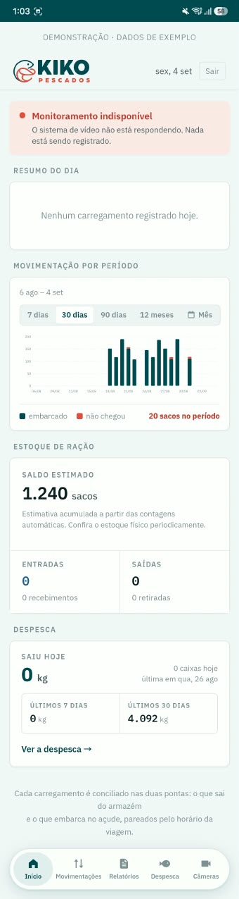 | 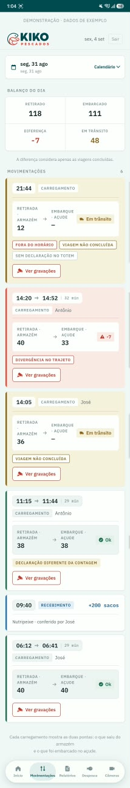 |  | 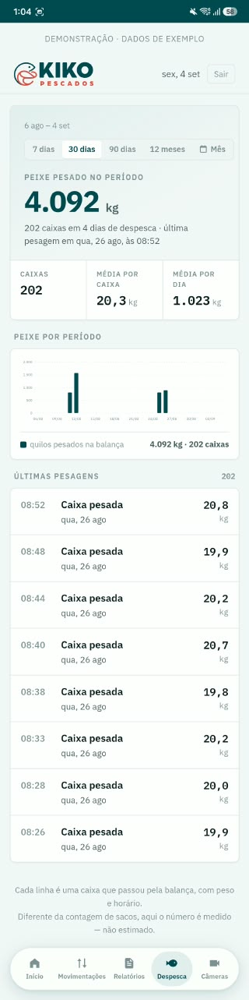 |
|---|---|---|---|
| Início | Movimentações | Relatórios | Despesca |

### 2.3 O vídeo

`referencia-mobile/kiko-09-navegacao-video.mp4` — a navegação em movimento.
É onde se vê a pílula **escorregando** entre as abas, e não piscando.

### 2.4 O que observar nessas capturas

- A barra é uma **ilha branca arredondada**, descolada da borda de baixo,
  com sombra. Não encosta na barra de gestos do Android.
- A pílula envolve **o ícone e o rótulo juntos**, não só o ícone.
- Não existe título repetindo o nome da aba. A aba acesa já diz onde você está —
  a tela começa direto no conteúdo.
- A barra de status do Android está **verde-petróleo**, na cor do sistema. É
  `<meta name="theme-color">`, e é um dos detalhes que fazem a página deixar de
  parecer site e passar a parecer aplicativo.
- Rótulos de seção minúsculos, em caixa alta espaçada e cinza
  (`RESUMO DO DIA`, `BALANÇO DO DIA`, `ESTOQUE DE RAÇÃO`): custam uma linha e
  orientam instantaneamente.
- Números grandes em fonte monoespaçada, alinhados em coluna
  (`118 / 111 / -7 / 48`).
- Nenhuma tabela. Onde teria tabela, há **cartões e linhas**.
- Nada corta. Nada sai pela direita. Nada rola de lado.

---

## 3. ⭐ A barra inferior flutuante — receita completa

Esta é a peça mais pedida, e a que mais deu errado na tentativa anterior. Vai
inteira, com o porquê de cada linha. **Os porquês importam:** cada um deles é um
erro que já foi cometido e corrigido, e uma regra sem motivo é uma regra que o
próximo refactor apaga.

### 3.1 Anatomia

```
  ┌─ .tabs ──────────────────────────────────────────────┐
  │  ┌──────────┐                                        │  ← ilha: fixed,
  │  │ .pilula  │  (irmã, z-index 0, POR BAIXO)          │    arredondada,
  │  └──────────┘                                        │    centralizada,
  │   [ícone]    [ícone]   [ícone]   [ícone]   [ícone]   │    com sombra
  │   Caixa      Painel   Produtos  Clientes    Mais     │  ← .tab, z-index 1
  └──────────────────────────────────────────────────────┘
         ↑ 14px + env(safe-area-inset-bottom)
  ════════ borda inferior da tela / barra de gestos ══════
```

### 3.2 O CSS (funcionando, copiado do Kiko)

```css
/* ---------- a ilha ----------

   Descolada da borda: trocar de seção não deve exigir rolar a página até o
   fim, e a barra não pode disputar espaço com a barra de gestos do sistema.

   ⚠️ NUNCA `bottom: 0`. O que dá o ar de aplicativo é justamente a folga. */
.tabs{
  position:fixed;
  left:50%; transform:translateX(-50%);
  bottom:calc(14px + env(safe-area-inset-bottom, 0px));
  width:calc(100% - 28px); max-width:404px;
  z-index:20;

  /* A grade é o coração do truque: N colunas iguais, e --n vem do componente.
     É ela que vai posicionar a pílula sem nenhuma conta de pixel. */
  display:grid; grid-template-columns:repeat(var(--n), 1fr); gap:2px;

  background:var(--surface);
  border:1px solid var(--line);
  border-radius:999px;
  padding:5px;
  box-shadow:var(--shadow-flutuante);
}

/* Vidro fosco onde houver suporte. O fundo sólido acima é o fallback, e ele
   já está aplicado — então nada quebra onde backdrop-filter não existe. */
@supports (backdrop-filter: blur(2px)){
  .tabs{
    background:color-mix(in srgb, var(--surface) 86%, transparent);
    backdrop-filter:blur(14px) saturate(1.4);
  }
}

/* ---------- as abas ----------
   position:relative + z-index:1 não é enfeite: é o que garante que ícone e
   rótulo fiquem POR CIMA da pílula, e não o contrário. */
.tab{
  grid-row:1; grid-column:var(--i);
  position:relative; z-index:1;
  display:flex; flex-direction:column; align-items:center; gap:3px;
  padding:8px 4px 7px;
  font-size:10.5px; font-weight:600; color:var(--ink-3);
  background:none; border:0; border-radius:999px;
  font-family:inherit; cursor:pointer; text-decoration:none;
  transition:background .15s, color .15s;
}
.tab svg{width:18px; height:18px}
.tab[aria-current="page"]{color:var(--accent)}
.tab:focus-visible{outline:2px solid var(--accent); outline-offset:1px}

/* Muitas abas: encolhe só o RÓTULO. O alvo de toque continua o mesmo. */
.tabs[data-n="5"] .tab{font-size:9.5px; padding:8px 2px 7px}
.tabs[data-n="6"] .tab{font-size:9px; padding:8px 1px 7px; letter-spacing:-.01em}
.tabs[data-n="6"] .tab svg{width:17px; height:17px}

/* ---------- a pílula ---------- */
.pilula{
  grid-row:1; grid-column:var(--i);
  position:relative; z-index:0;
  border-radius:999px;
  background:var(--accent-soft);
}
```

### 3.3 As quatro decisões que fazem isso funcionar

**(a) A pílula é IRMÃ das abas, não o fundo do link.** No HTML ela vem **antes**
de todas as abas.

> Dois motivos, e os dois já custaram retrabalho.
> **Fundo não escorrega:** ele acende aqui e apaga ali. O que se anima é
> posição, e posição só existe em um elemento próprio.
> **Empilhamento:** dentro do link, a pílula fica presa ao contexto de
> empilhamento *dele*. Como o link ativo pode ser o último da barra, a pílula
> passava **por cima** e apagava o ícone e o rótulo de cada aba que
> atravessava. Fora, e primeiro, ela passa por baixo — que é o que se vê no
> aplicativo da Uber.

**(b) A célula vem do `--i`, e não há conta de pixel em lugar nenhum.** A pílula
ocupa a **mesma célula de grade** da aba ativa. Consequências de graça:

- ela tem exatamente a largura da aba, sempre;
- se o rótulo crescer e a coluna crescer junto, ela acompanha sozinha;
- quando a barra vira coluna vertical no desktop, a **mesma** regra funciona
  trocando `grid-column` por `grid-row`.

**(c) As colunas são `1fr`, e não `minmax(0,1fr)`.** Com `1fr`, um rótulo longo
("Produtos", "Clientes") faz a coluna crescer uns pixels e as outras cedem.
Forçar todas iguais espremeria esse rótulo contra o vizinho — custo permanente,
lido o dia inteiro. O custo da desigualdade é só o **ponto de partida** da
animação sair alguns pixels do lugar no primeiro quadro; a **chegada é sempre
exata**, porque o fim da animação é `translate` zero.

**(d) O `body` reserva o espaço da barra.**

```css
body{
  /* 92px = altura da barra + folga. Sem isso a barra cobre o fim da lista. */
  padding-bottom:calc(92px + env(safe-area-inset-bottom, 0px));
}
```

⚠️ Isto e o `position:fixed` são coisas diferentes e as duas são obrigatórias.
`fixed` faz a barra estar sempre visível; o `padding-bottom` faz o **conteúdo**
terminar acima dela. Faltando o primeiro, você rola até o fim para achar a
barra; faltando o segundo, a última linha da lista fica escondida embaixo dela
para sempre. Nas capturas atuais **os dois** estão faltando — em *Vendas* a
barra corta a venda nº 66, em *Produtos* ela corta a linha "Estoque".

### 3.4 ⭐ A animação: a pílula escorrega

```css
@media (prefers-reduced-motion: no-preference){

  /* A distância sai de uma CONTA, não de medida em pixel: a pílula ocupa uma
     aba inteira, então 100% é exatamente a largura de uma aba, e +2px é o vão
     (o `gap`). Uma casa andada = 100% + 2px — valha a barra 4, 5 ou 6 abas, e
     valha ela deitada no celular ou de pé no painel.

     --aba-de é quantas casas ATRÁS ficou a aba anterior. Sem ela, o fallback 0
     zera o deslocamento e nada se move — que é o certo quando não se veio de
     outra aba (primeira visita, login, endereço digitado). */
  @keyframes escorregar-aba{
    from{translate: calc(var(--aba-de, 0) * (100% + 2px)) 0}
    to  {translate: 0 0}
  }
  @keyframes escorregar-aba-coluna{
    from{translate: 0 calc(var(--aba-de, 0) * (100% + 2px))}
    to  {translate: 0 0}
  }

  .pilula{animation: escorregar-aba .28s cubic-bezier(.4,0,.2,1) both}
  @media (min-width:1024px){ .pilula{animation-name: escorregar-aba-coluna} }
}
```

**A curva não é a da casa.** A curva de entrada (`.2,.7,.3,1`) dispara e
desacelera — serve para algo que **aparece**. Aqui o objeto **já existe** e
apenas **viaja**: precisa sair devagar também, senão parece arrancado. Daí a
`ease-in-out` `cubic-bezier(.4,0,.2,1)`, e os **0,28s** medidos no vídeo.

**Por que ela precisa escorregar, e não piscar:** o traço contínuo é o que diz
que ainda é a **mesma** marca de "você está aqui", só que noutro lugar.
Piscando, leem-se duas pílulas.

### 3.5 Versão React (é o caso deste projeto)

O Kiko é servido página a página e descobre a aba anterior pelo
`document.referrer`. Numa SPA é **mais fácil**: a rota anterior está na mão.

```tsx
import { useLocation, NavLink } from 'react-router-dom'
import { useEffect, useRef, type CSSProperties } from 'react'

const ABAS = [
  { to: '/caixa',    rotulo: 'Caixa',    Icone: IconeCarrinho },
  { to: '/painel',   rotulo: 'Painel',   Icone: IconePainel   },
  { to: '/produtos', rotulo: 'Produtos', Icone: IconeCaixa    },
  { to: '/clientes', rotulo: 'Clientes', Icone: IconePessoas  },
  { to: '/mais',     rotulo: 'Mais',     Icone: IconeMais     },
]

export function NavInferior() {
  const { pathname } = useLocation()
  const atual = ABAS.findIndex(a => pathname.startsWith(a.to))

  // Durante a renderização o ref ainda guarda a aba ANTERIOR — o efeito só
  // roda depois. É exatamente disso que a animação precisa.
  const anterior = useRef(atual)
  const casas = anterior.current >= 0 && atual >= 0 ? anterior.current - atual : 0
  useEffect(() => { anterior.current = atual }, [atual])

  return (
    <nav className="tabs" aria-label="Seções"
         data-n={ABAS.length}
         style={{ '--n': ABAS.length } as CSSProperties}>

      {/* key={atual} força o React a recriar o nó — e é o que faz a animação
          CSS TOCAR DE NOVO a cada troca de aba. Sem a key ela roda uma vez só,
          na montagem, e nunca mais. */}
      {atual >= 0 && (
        <span key={atual} className="pilula" aria-hidden="true"
              style={{ '--i': atual + 1, '--aba-de': casas } as CSSProperties} />
      )}

      {ABAS.map(({ to, rotulo, Icone }, i) => (
        <NavLink key={to} to={to} className="tab"
                 style={{ '--i': i + 1 } as CSSProperties}
                 aria-current={i === atual ? 'page' : undefined}>
          <Icone aria-hidden="true" />
          {rotulo}
        </NavLink>
      ))}
    </nav>
  )
}
```

> Existe o caminho `layoutId` do Framer Motion, que faz o mesmo efeito. **Não
> use aqui:** o projeto não tem `framer-motion` nas dependências, e a versão CSS
> acima são dez linhas, zero bytes de runtime e funciona com JavaScript
> desligado. Não vale uma biblioteca inteira.

### 3.6 A resposta ao toque (não pule esta parte)

```css
/* O navegador do celular pinta um retângulo cinza-azulado sobre a caixa
   inteira do elemento tocado. Ele cobre cantos arredondados e atravessa
   sombras. */
html{-webkit-tap-highlight-color: transparent}
```

⚠️ **Desligar e não pôr nada no lugar é PIOR que o retângulo.** Aquele lampejo
é a única confirmação de que o toque pegou, e sem ela o botão parece quebrado.
Cada coisa clicável precisa do seu próprio `:active`:

```css
/* Afunda um pixel e escurece de leve, como uma tecla sendo apertada.
   Sem transição, de propósito: no toque esta é a ÚNICA resposta que existe, e
   atrasá-la é atrasar a confirmação justamente onde ela importa. */
.btn:active, .tab:active, .card-acao:active{transform: translateY(1px)}
.btn:active{filter: brightness(.94)}
.tab:active{background: var(--surface-2)}

/* A aba ATUAL não escurece o fundo: o fundo dela é a PÍLULA, que é irmã e fica
   por baixo — o cinza do link a apagaria sob o dedo. Quem afunda é a pílula,
   junto com o ícone, e é isso que se sente.
   `translate` (da animação) e `transform` (daqui) são propriedades diferentes
   e se somam: um não anula o outro. */
.tab[aria-current="page"]:active{background: none}
.tabs:has(.tab[aria-current="page"]:active) .pilula{transform: translateY(1px)}
```

E **todo** `:hover` precisa de guarda:

```css
@media (hover: hover){
  .btn:hover{ /* … */ }
}
```

Sem a guarda, o celular entra no estado de hover ao tocar e **fica preso nele**
depois que o dedo sai — o item continua destacado como se o ponteiro estivesse
sobre ele.

### 3.7 No desktop a mesma barra vira coluna

Barra inferior é **idioma de celular**. Num monitor ela fica longe do olho e do
cursor. A mesma grade, virada de pé:

```css
@media (min-width:1024px){
  body{padding-bottom:0}

  .tabs{
    position:static; transform:none; width:auto; max-width:none; z-index:auto;
    display:grid; grid-template-columns:1fr; gap:2px;
    padding:0; background:none; border:0; border-radius:0;
    box-shadow:none; backdrop-filter:none;
  }
  /* uma coluna e uma linha por aba: a MESMA pílula, no outro eixo */
  .tab, .pilula{grid-column:1; grid-row:var(--i)}
  .tab{flex-direction:row; justify-content:flex-start; gap:11px;
       padding:9px 12px; font-size:13.5px; border-radius:6px}
  .pilula{border-radius:6px}   /* na coluna ela é item de menu, não cápsula */

  /* :not() na aba atual porque o fundo dela agora é a PÍLULA, um irmão que
     fica por baixo: pintar o fundo do link a esconderia justamente quando o
     ponteiro está em cima dela. */
  @media (hover:hover){
    .tab:hover:not([aria-current="page"]){background:var(--surface-2)}
  }
}
```

### 3.8 E o tablet?

Um tablet em retrato (768–1023px) **não** é um desktop pequeno e **não** é um
celular grande.

- A ilha flutuante **continua** — o polegar continua embaixo. Só cresce:
  `max-width: 520px`, `font-size: 12px`, ícones de 20px.
- O conteúdo vira **duas colunas de cartões**, não uma tabela.
- ⚠️ **O erro a evitar:** deixar o breakpoint de desktop cair em 768px. A
  tabela volta, e volta espremida. O corte para o layout de painel é **1024px**.
- Em paisagem (≥1024px) o tablet recebe o layout de desktop, e está certo.

---

## 4. O outro flutuante: o botão "Assistente"

Ele hoje é o pior vizinho da tela — cobre nome de cliente, preço e valor de
venda, nas quatro capturas.

Três regras, em ordem de preferência:

1. **Ele mora acima da barra, na mesma ilha de coordenadas:**
   ```css
   .fab-assistente{
     position:fixed; z-index:19;   /* abaixo do 20 das abas */
     right:max(14px, calc(50vw - 202px + 14px));   /* alinhado à ilha */
     bottom:calc(14px + 62px + env(safe-area-inset-bottom, 0px));
   }
   ```
   Os 62px são a altura da barra; ele nunca a sobrepõe e nunca sobrepõe a
   última linha da lista, porque o `padding-bottom` do `body` cresce junto.

2. **Ele encolhe ao rolar para baixo.** Descendo a lista, vira só o círculo com
   o ícone; parado ou subindo, o rótulo volta. Uma transição de `max-width` e
   `opacity` no texto resolve.

3. **Ele nunca fica sobre uma coluna de valores.** Se a lista tem número à
   direita, o botão sobre ela apaga exatamente o dado que a pessoa foi buscar.

---

## 5. Estrutura de página no celular

A ordem do Kiko, de cima para baixo — e o que ela economiza:

```
[ barra de status do sistema ]  ← theme-color, na cor do sistema
  banner opcional (uma linha, 12px, caixa alta, cinza)
  ┌ cabeçalho fixo (sticky) ─────────────────────┐
  │  LOGO                       data     [Sair]  │  ← UMA linha só
  └──────────────────────────────────────────────┘
  ALERTA (se houver)
  RÓTULO DE SEÇÃO                                  ← 11px, caixa alta, cinza
  ┌ cartão ──────────────────────────────────────┐
  └──────────────────────────────────────────────┘
  RÓTULO DE SEÇÃO
  ┌ cartão ──────────────────────────────────────┐
  └──────────────────────────────────────────────┘
  nota de rodapé (12px, cinza, centralizada)
  ╌╌╌ espaço reservado pelo padding-bottom ╌╌╌
        ⌒⌒⌒ a ilha de navegação ⌒⌒⌒
```

```css
.app{
  max-width:430px; margin:12px auto 0;
  display:flex; flex-direction:column; gap:16px;
  padding:0 14px;
}

/* No celular o cabeçalho é uma faixa de topo grudenta.
   As margens negativas anulam o padding lateral do .app: sem elas sobrariam
   14px de cada lado por onde o conteúdo apareceria passando por trás.
   z-index abaixo do 20 das abas: a faixa nunca cobre a navegação. */
.barra{
  position:sticky; top:0; z-index:15;
  background:var(--ground);
  display:flex; align-items:center; justify-content:space-between; gap:12px;
  margin:0 -14px; padding:13px 20px 11px;
  border-bottom:1px solid var(--line);
}
```

### 5.1 O que sai da tela do celular

- **O hambúrguer.** Ou barra inferior, ou gaveta. Não os dois. O que não coube
  nas cinco abas vai para uma aba "Mais", que é uma página normal com uma lista
  de links — não um menu sobreposto.
- **O `<h1>` com o nome da aba.** A pílula acesa já diz onde você está. Repetir
  "Clientes" gasta 60px de altura para informar o que já está informado.
- **O parágrafo explicativo de quatro linhas.** No celular ele vira:
  - uma linha de 12,5px em `--ink-3` logo abaixo do rótulo de seção; ou
  - some, e o texto completo fica na tela de ajuda.

  ⚠️ O texto de ajuda do desktop é escrito para uma linha de 80 caracteres.
  Reaproveitá-lo literalmente é o que produz aqueles blocos de seis linhas.

### 5.2 Rótulo de seção — o padrão mais barato do documento

```css
.block-title{
  font-size:11px; font-weight:600; letter-spacing:.10em;
  text-transform:uppercase; color:var(--ink-3); margin:0;
}
```

Uma linha de 15px de altura que faz o trabalho que o título de 34px estava
tentando fazer, e ainda deixa espaço para a contagem à direita
(`MOVIMENTAÇÕES … 6`, na captura de Movimentações).

---

## 6. ⭐ Tabela vira lista. Sempre.

Esta é a regra que mais muda as telas de *Clientes*, *Produtos* e *Vendas*.

Uma tabela precisa de largura para funcionar: as colunas só significam alguma
coisa quando estão lado a lado e alinhadas. Em 360px não há largura. As três
saídas erradas, na ordem em que costumam ser tentadas:

| Saída errada | O que acontece |
|---|---|
| Deixar a tabela vazar | rolagem horizontal na página inteira — é o estado atual |
| `overflow-x: auto` na tabela | o usuário rola de lado item por item e nunca compara nada |
| Esconder colunas com `display:none` | o dado some sem aviso e ninguém descobre que existia |

**A saída certa: a linha vira um item de lista de duas alturas.** Identidade à
esquerda, número à direita.

```
┌────────────────────────────────────────────┐
│  Alexandra Caciano de Souza      R$ 295,00 │  ← identidade + valor
│  (85) 9.9197-9290 · desde 14/06    [chip]  │  ← metadados, 12,5px cinza
└────────────────────────────────────────────┘
```

```css
/* O molde do Kiko: identidade flui, número não. `min-width:0` na coluna do
   meio é obrigatório — sem ele um nome longo estoura a grade em vez de quebrar,
   e é assim que aparece rolagem horizontal onde não deveria haver nenhuma. */
.item{
  display:grid; grid-template-columns:auto minmax(0,1fr) auto;
  gap:12px; align-items:start;
  padding:12px 15px; border-bottom:1px solid var(--line);
}
.item:last-child{border-bottom:0}
.item-nome{font-size:14.5px; font-weight:600; line-height:1.35}
.item-meta{font-size:12.5px; color:var(--ink-2)}
.item-valor{
  font-family:"IBM Plex Mono", ui-monospace, monospace;
  font-size:17px; font-weight:600;
  font-variant-numeric: tabular-nums;   /* alinha as casas em coluna */
  text-align:right; white-space:nowrap;
}
```

Notas que valem por si:

- **`font-variant-numeric: tabular-nums` em todo número.** É o que faz
  `R$ 295,00` e `R$ 70,00` alinharem a vírgula sem tabela. Sem isso os
  algarismos têm larguras diferentes e a coluna dança.
- **O nome do cliente sai da CAIXA ALTA.** Maiúscula destrói a silhueta da
  palavra, fica mais larga e força a quebra em três linhas. Use o nome como
  está, em `font-weight:600`.
- **Um identificador visual só.** Ou o avatar de iniciais, ou o ícone genérico
  — não os dois. E, se as iniciais ficarem, o fundo é `--surface-2` com texto
  `--ink-2`: cor aleatória por cliente é ruído que compete com o vermelho da
  dívida (ver §8).
- **Ações (lápis / lixeira) numa terceira linha ou num menu.** Elas não cabem
  na linha do valor sem espremer o valor, e precisam de 44×44 cada.

### 6.1 Se uma tabela precisar mesmo sobreviver

Só numa tela de conferência, e sob duas condições:

```css
.tabela-rolante{overflow-x:auto; overscroll-behavior-x:contain}
```

O contêiner rola; **a página, nunca**. `overscroll-behavior-x: contain` impede
que o gesto vaze para a página e dispare o "voltar" do navegador.

---

## 7. Densidade, espaçamento e alvos de toque

- **Escala de 8** (com meios onde precisar): 2, 4, 6, 8, 10, 12, 14, 16, 22, 26.
  Um número que não esteja na escala é um número que alguém chutou.
- **Espaço entre cartões: 16px.** Entre seções: 16px também, porque o rótulo de
  seção já separa.
- **Padding interno de cartão: 14–18px.** Não 24px — no celular isso é 13% da
  largura da tela em cada lado.
- **Altura de item de lista: 56–72px.** Hoje está em ~150px. A meta é dobrar a
  quantidade de itens por tela.
- **Alvo de toque mínimo: 44×44px**, mesmo que o ícone tenha 16px. A área vem
  do padding, não do tamanho do desenho.
- **Raio de canto: 8px em cartões, 6px em botões e campos, 999px na ilha de
  navegação e nos chips.** Três valores, e só.
- **Sombra em duas camadas, sempre discreta:**
  ```css
  --shadow: 0 1px 2px rgba(1,74,84,.06);
  --shadow-flutuante: 0 6px 24px rgba(1,74,84,.16), 0 1px 3px rgba(1,74,84,.10);
  ```
  A sombra grande é só para o que **flutua** de verdade (a barra, um modal). Um
  cartão numa lista leva a pequena, ou vira relevo sobre relevo.

---

## 8. Cor: tokens, e o que cada vermelho quer dizer

Nada de `text-red-500` espalhado pelo JSX. Uma paleta declarada três vezes:
clara, escura por preferência do sistema, escura por escolha explícita.

```css
:root{
  --ground:#F4F7F7; --surface:#FFFFFF; --surface-2:#F0F4F4;
  --ink:#0C1F22; --ink-2:#4A5F62; --ink-3:#7E9295;
  --line:#DFE7E7; --line-strong:#C4D1D2;
  --accent:#014A54; --accent-soft:#E4EEEF;

  /* ⭐ Dois vermelhos, e a diferença é funcional:
     --critical-fill é a cor pura da marca, para FAIXAS e BARRAS, onde não há
     texto por cima. --critical é a versão escurecida, para TEXTO legível sobre
     branco. Usar a pura em texto dá contraste insuficiente; usar a escura numa
     faixa deixa a faixa suja. */
  --critical:#C4392B; --critical-fill:#E84C3D; --critical-soft:#FBEAE7;

  /* Estados do sistema, dessaturados de propósito para não competirem com as
     cores da identidade. */
  --warn:#8A6218;     --warn-soft:#F8F1E0;
  --positive:#1F6B54; --positive-soft:#E6F1ED;
  --info:#1B5C93;     --info-soft:#E6EFF7;

  --on-fill:#FFFFFF;  /* texto sobre preenchimento — muda no tema escuro! */
}

@media (prefers-color-scheme: dark){
  :root:not([data-theme="light"]){
    --ground:#08181B; --surface:#0E2226; --surface-2:#142C31;
    --ink:#E4EDEE; --ink-2:#9AB0B2; --ink-3:#6F8688;
    --line:#1D3237; --line-strong:#2A4348;
    --accent:#5FB3BC; --accent-soft:#0C2E33;
    --critical:#F0857A; --critical-fill:#E84C3D; --critical-soft:#2E1613;
    --on-fill:#08181B;   /* no escuro o acento é claro: o texto sobre ele é escuro */
  }
}
:root[data-theme="dark"]{ /* … a mesma lista, para o botão de tema … */ }
```

⚠️ **Nunca dê a uma cor a sua única definição dentro de um bloco de media
query.** A definição base vive no `:root` limpo; a media query e o
`[data-theme]` apenas **redefinem**. Do contrário um tema fica com o token
indefinido e o elemento pinta transparente.

Regras de uso:

- **Nenhuma cor literal fora do bloco de tokens.** Se apareceu um `#` no JSX,
  é um token faltando.
- **Cor que não codifica nada é ruído.** Os avatares rosa/roxo/verde/vermelho
  de hoje ensinam o olho a ignorar cor — e aí o vermelho de "R$ 295,00 em
  atraso" também é ignorado.
- **A barra de status do Android.** `<meta name="theme-color" content="#…">` no
  `<head>`. É a diferença entre "abri um site" e "abri um aplicativo" (compare
  o topo das capturas do Kiko com o das atuais).
- **Contraste:** texto normal ≥ 4,5:1; rótulos de 11px em `--ink-3` são o piso —
  não invente um cinza mais claro que esse.

---

## 9. Tipografia

```css
body{
  font-family:"IBM Plex Sans", ui-sans-serif, system-ui, sans-serif;
  font-size:15px; line-height:1.5;
  -webkit-font-smoothing:antialiased;
}
```

- **Uma família, dois cortes.** Sans no texto; **Mono nos números que precisam
  alinhar em coluna** (valores, quantidades, horários). Não use Mono em texto
  que contém palavra — vira máquina de escrever.
- **Escala no celular:** 26px o número herói de um cartão; 19px um valor
  destacado; 15px o corpo; 14,5px nome em lista; 12,5px metadado; 11px rótulo
  de seção. **Nada de 34px num celular.**
- **Caixa alta só em rótulo minúsculo** (11px, `letter-spacing:.10em`). Nunca em
  dado — nome de cliente, nome de produto, descrição.
- **`font-variant-numeric: tabular-nums`** em tudo que é número em coluna.
- Peso: 400 corpo, 500 metadado destacado, 600 título e valor, 700 só o número
  herói. Quatro pesos, e chega.

---

## 10. Movimento

Regra única, e vale a pena decorar: **o movimento roda UMA vez, na entrada.
Nada pisca e nada repete.** Estas telas ficam abertas o dia inteiro; animação
que repete vira ruído até a pessoa parar de ver a tela.

```css
@media (prefers-reduced-motion: no-preference){
  @keyframes surgir{from{opacity:0; transform:translateY(9px)} to{opacity:1; transform:none}}

  .lista > .item{animation: surgir .36s cubic-bezier(.2,.7,.3,1) both}
  .lista > .item:nth-child(2){animation-delay:.05s}
  .lista > .item:nth-child(3){animation-delay:.10s}
  .lista > .item:nth-child(4){animation-delay:.15s}
  .lista > .item:nth-child(5){animation-delay:.20s}
  /* ⚠️ O escalonamento TRAVA aqui. Sem este teto, o item 40 chegaria dois
     segundos depois do primeiro e a lista pareceria travada. */
  .lista > .item:nth-child(n+6){animation-delay:.24s}
}
```

- **Todo o bloco dentro de `prefers-reduced-motion: no-preference`.** Com
  movimento reduzido nada fica faltando — as coisas simplesmente aparecem.
- **Anime `transform`, `translate`, `opacity` e `filter`.** Não `top`, `left`,
  `width`, `height`: essas passam pelo layout a cada quadro e engasgam num
  celular modesto.
- **Curvas:** `cubic-bezier(.2,.7,.3,1)` para o que **entra** (dispara e
  desacelera); `cubic-bezier(.4,0,.2,1)` para o que **viaja** (a pílula).
- **Durações:** 150–200ms para resposta a toque; 280–360ms para entrada;
  nada acima de 500ms, exceto abertura de bloco recolhível.

---

## 11. Como testar (e o teste que pega o bug de hoje)

**Larguras obrigatórias** no modo dispositivo do DevTools:

| Largura | O que é | O que checar |
|---|---|---|
| 360×640 | o piso real | nada corta, nada rola de lado |
| 390×844 | iPhone moderno | `env(safe-area-inset-bottom)` afasta a ilha |
| 412×915 | Android comum | é o das capturas |
| 768×1024 | tablet retrato | duas colunas, ilha maior, **sem tabela** |
| 1024×768 | tablet paisagem | vira painel, barra vira coluna |

**O teste de rolagem horizontal** — cole no console e ele aponta o culpado:

```js
const L = document.documentElement.clientWidth;
[...document.querySelectorAll('*')]
  .filter(e => e.getBoundingClientRect().right > L + 1)
  .forEach(e => console.warn(
    Math.round(e.getBoundingClientRect().right - L) + 'px além:', e));
```

Rode em **todas** as telas. Enquanto ele imprimir algo, o mobile não está pronto.
Na maioria esmagadora dos casos a causa é uma de três: um `<table>`, uma largura
fixa em px, ou um item de grade/flex **sem `min-width: 0`** (o padrão `auto` faz
o item se recusar a encolher abaixo do conteúdo).

**A prévia de aparelhos.** O Kiko tem uma rota `/previa` que renderiza a
aplicação dentro de um `<iframe>` com as medidas exatas de cada aparelho, lado a
lado. Vale copiar a ideia: é a diferença entre "acho que ficou bom" e ver as
cinco larguras de uma vez.

**Teste no aparelho de verdade, com o dedo.** Emulador não mostra hover preso,
não mostra a barra de gestos comendo a navegação, e não mostra que o alvo de
toque é pequeno demais.

---

## 12. Checklist de entrega

Nenhum destes é opcional.

**Estrutura**
- [ ] Nenhuma tela rola na horizontal (§11, teste do console, em todas as rotas)
- [ ] Nenhuma `<table>` abaixo de 1024px — todas viraram listas
- [ ] Nenhuma largura fixa em px em elemento de layout
- [ ] Todo item de grade/flex com texto tem `min-width: 0`
- [ ] Ou hambúrguer, ou barra inferior — não os dois
- [ ] Nenhum `<h1>` repetindo o nome da aba ativa

**Barra de navegação**
- [ ] `position: fixed` (aparece sem rolar)
- [ ] `bottom: calc(14px + env(safe-area-inset-bottom, 0px))` — descolada
- [ ] `border-radius: 999px`, com sombra flutuante
- [ ] `body` tem `padding-bottom` reservando a altura dela
- [ ] A pílula é **irmã** das abas e vem **antes** delas no DOM
- [ ] A pílula envolve ícone **e** rótulo
- [ ] A pílula **escorrega** entre abas, em 0,28s, `cubic-bezier(.4,0,.2,1)`
- [ ] `aria-current="page"` na aba ativa e `aria-label` no `<nav>`
- [ ] Alvo de toque ≥ 44px de altura em cada aba
- [ ] Vira coluna lateral em ≥1024px

**Toque**
- [ ] `-webkit-tap-highlight-color: transparent` **e** um `:active` próprio em
      tudo que é clicável
- [ ] Todo `:hover` dentro de `@media (hover: hover)`
- [ ] Alvos de 44×44 mínimo, inclusive lápis e lixeira

**Cor e tipo**
- [ ] Zero cor literal fora do bloco de tokens
- [ ] Tema escuro nas três declarações
- [ ] `<meta name="theme-color">` no `<head>`
- [ ] `font-variant-numeric: tabular-nums` em todo número em coluna
- [ ] Nenhum dado em CAIXA ALTA (só rótulos de 11px)
- [ ] Nenhum título acima de 26px no celular

**Movimento**
- [ ] Tudo dentro de `@media (prefers-reduced-motion: no-preference)`
- [ ] Nada repete, nada pisca, nada faz loop
- [ ] Escalonamento de lista com teto (§10)

**Flutuantes**
- [ ] O "Assistente" não cobre dado nenhum, em nenhuma rota
- [ ] Ele vive acima da barra, com `z-index` menor que o dela

---

## 13. O resumo de uma frase

**Não encolha a tela de desktop — escreva a de celular.** É o mesmo HTML e o
mesmo React; o que muda é que a coluna única, a lista no lugar da tabela e a
ilha flutuante de navegação são o **estado base**, e o painel de desktop é o
caso especial que chega depois, no `@media (min-width: 1024px)`.
